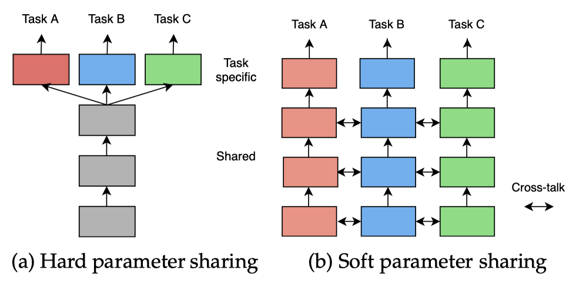

# Awesome Multi-Task Learning

By [Jialong Wu](https://github.com/Manchery).

A curated list of datasets, codebases and papers on Multi-Task Learning (MTL), from Machine Learning perspective. I greatly appreciate those surveys below, which helped me a lot. 

Please let me know if you find any mistakes or omissions! Your contribution is welcome!

## Table of Contents

  
Awesome Multi-Task Learning

- [Survey](#survey)
- [Benchmark & Dataset](#benchmark--dataset)
  - [Computer Vision](#computer-vision)
  - [NLP](#nlp)
  - [RL & Robotics](#rl--robotics)
  - [Graph](#graph)
  - [Recommendation](#recommendation)
- [Codebase](#codebase)
- [Architecture](#architecture)
  - [Hard Parameter Sharing](#hard-parameter-sharing)
  - [Soft Parameter Sharing](#soft-parameter-sharing)
  - [Decoder-focused Model](#decoder-focused-model)
  - [Modulation & Adapters](#modulation--adapters)
  - [Modularity, MoE, Routing & NAS](#modularity-moe-routing--nas)
  - [Task Representation](#task-representation)
  - [Others](#others)
- [Optimization](#optimization)
  - [Loss & Gradient Strategy](#loss--gradient-strategy)
  - [Task Sampling](#task-sampling)
  - [Adversarial Training](#adversarial-training)
  - [Pareto](#pareto)
  - [Distillation](#distillation)
  - [Consistency](#consistency)
- [Task Relationship Learning: Grouping, Tree (Hierarchy) & Cascading](#task-relationship-learning-grouping-tree-hierarchy--cascading)
- [Theory](#theory)
- [Misc](#misc)

## Survey

- ✨ Vandenhende, S., Georgoulis, S., Proesmans, M., Dai, D., & Van Gool, L.  [Multi-Task Learning for Dense Prediction Tasks: A Survey](https://arxiv.org/abs/2004.13379). TPAMI, 2021.
- Crawshaw, M.  [Multi-Task Learning with Deep Neural Networks: A Survey](http://arxiv.org/abs/2009.09796). ArXiv, 2020. 
- Worsham, J., & Kalita, J.  [Multi-task learning for natural language processing in the 2020s: Where are we going?](https://doi.org/10.1016/j.patrec.2020.05.031) *Pattern Recognition Letters*, 2020.
- Gong, T., Lee, T., Stephenson, C., Renduchintala, V., Padhy, S., Ndirango, A., Keskin, G., & Elibol, O. H.  [A Comparison of Loss Weighting Strategies for Multi task Learning in Deep Neural Networks](https://ieeexplore.ieee.org/document/8848395). IEEE Access, 2019.
- Li, J., Liu, X., Yin, W., Yang, M., Ma, L., & Jin, Y.  [Empirical Evaluation of Multi-task Learning in Deep Neural Networks for Natural Language Processing](https://link.springer.com/article/10.1007/s00521-020-05268-w). Neural Computing and Applications, 2021.
- ✨ Ruder, S.  [An Overview of Multi-Task Learning in Deep Neural Networks](http://arxiv.org/abs/1706.05098). ArXiv, 2017. 
- ✨ Zhang, Y., & Yang, Q.  [A Survey on Multi-Task Learning](https://ieeexplore.ieee.org/abstract/document/9392366). IEEE TKDE, 2021.

## Benchmark & Dataset

### Computer Vision

- MultiMNIST / MultiFashionMNIST
  - a multitask variant of the MNIST / FashionMNIST dataset
  - ⚠️ *Toy datasets*
  - See: [MGDA](http://arxiv.org/abs/1810.04650), [Pareto MTL](http://papers.nips.cc/paper/9374-pareto-multi-task-learning.pdf), [IT-MTL](https://arxiv.org/abs/2010.15413), *etc*.
- ✨ NYUv2 [[URL](https://cs.nyu.edu/~silberman/datasets/nyu_depth_v2.html)]
  - 3 Tasks: Semantic Segmentation, Depth Estimation, Surface Normal Estimation
  - Silberman, N., Hoiem, D., Kohli, P., & Fergus, R. (2012). [Indoor Segmentation and Support Inference from RGBD Images](https://cs.nyu.edu/~silberman/papers/indoor_seg_support.pdf). ECCV, 2012.
- ✨ CityScapes [[URL](https://www.cityscapes-dataset.com/)]
  - 3 Tasks: Semantic Segmentation, Instance Segmentation, Depth Estimation
- ✨ PASCAL Context [[URL](https://cs.stanford.edu/~roozbeh/pascal-context/)]
  - Tasks: Semantic Segmentation, Human Part Segmentation, Semantic Edge Detection, Surface Normals Prediction, Saliency Detection.
- ✨ CelebA [[URL](http://mmlab.ie.cuhk.edu.hk/projects/CelebA.html)]
  - Tasks: 40 human face Attributes.
- ✨ Taskonomy [[URL](http://taskonomy.stanford.edu/)]
  - 26 Tasks: Scene Categorization, Semantic Segmentation, Edge Detection, Monocular Depth Estimation, Keypoint Detection, *etc*.
- Visual Domain Decathlon [[URL](https://www.robots.ox.ac.uk/~vgg/decathlon/)]
  - 10 Datasets: ImageNet, Aircraft, CIFAR100, *etc*. 
  - Multi-domain multi-task learning
  - Rebuffi, S.-A., Bilen, H., & Vedaldi, A.  [Learning multiple visual domains with residual adapters](https://arxiv.org/abs/1705.08045). NeurIPS, 2017.
- BDD100K [[URL](https://bdd-data.berkeley.edu/)]
  - 10-task Driving Dataset
  - Yu, F., Chen, H., Wang, X., Xian, W., Chen, Y., Liu, F., Madhavan, V., & Darrell, T.  [BDD100K: A Diverse Driving Dataset for Heterogeneous Multitask Learning](http://arxiv.org/abs/1805.04687). CVPR, 2020.
- MS COCO
  - Object detection, pose estimation, semantic segmentation.
  - See: [MultiTask-CenterNet (MCN): Efficient and Diverse Multitask Learning using an Anchor Free Approach](http://arxiv.org/abs/2108.05060).
- Omnidata [[URL](https://omnidata.vision/)]
  - A pipeline to resample comprehensive 3D scans from the real-world into static multi-task vision datasets
  - Eftekhar, A., Sax, A., Bachmann, R., Malik, J., & Zamir, A.  [Omnidata: A Scalable Pipeline for Making Multi-Task Mid-Level Vision Datasets from 3D Scans](http://arxiv.org/abs/2110.04994). ICCV, 2021. 

### NLP

- ✨ GLUE \- General Language Understanding Evaluation [[URL](https://gluebenchmark.com/)]
- ✨ decaNLP - The Natural Language Decathlon: A Multitask Challenge for NLP [[URL](https://github.com/salesforce/decaNLP)]
- WMT Multilingual Machine Translation

### RL & Robotics

- ✨ MetaWorld [[URL](https://meta-world.github.io/)]
- MTEnv [[URL](https://github.com/facebookresearch/mtenv)]

### Graph

- QM9 [[URL](https://www.nature.com/articles/sdata201422)]
  - 11 properties of molecules; multi-task regression
  - See: [Multi-Task Learning as a Bargaining Game](http://arxiv.org/abs/2202.01017).

### Recommendation

- MovieLens [[URL](https://www.tensorflow.org/datasets/catalog/movielens)]
  - 2 Task: binary classification (whether the user will watch) & regression (user’s rating)
  - See: [DSelect-k: Differentiable Selection in the Mixture of Experts with Applications to Multi-Task Learning](http://arxiv.org/abs/2106.03760)

## Codebase

- **General**
  - ✨ [LibMTL](https://github.com/median-research-group/libmtl): LibMTL: A PyTorch Library for Multi-Task Learning
  - [MALSAR](https://github.com/jiayuzhou/MALSAR): Multi-task learning via Structural Regularization (⚠️ Non-deep Learning)
- **Computer Vision**
  - ✨ [Multi-Task-Learning-PyTorch](https://github.com/SimonVandenhende/Multi-Task-Learning-PyTorch): PyTorch implementation of multi-task learning architectures
  - ✨ [mtan](https://github.com/lorenmt/mtan): The implementation of "End-to-End Multi-Task Learning with Attention"
  - ✨ [auto-lambda](https://github.com/lorenmt/auto-lambda): The Implementation of "Auto-Lambda: Disentangling Dynamic Task Relationships"
  - [astmt](https://github.com/facebookresearch/astmt): Attentive Single-tasking of Multiple Tasks
- **NLP**
  - ✨ [mt-dnn](https://github.com/namisan/mt-dnn): Multi-Task Deep Neural Networks for Natural Language Understanding
- **Recommendation System**
  - ✨ [MTReclib](https://github.com/easezyc/Multitask-Recommendation-Library): MTReclib provides a PyTorch implementation of multi-task recommendation models and common datasets.
- **RL**
  - [mtrl](https://github.com/facebookresearch/mtrl): Multi Task RL Baselines

## Architecture

### Hard Parameter Sharing

- Heuer, F., Mantowsky, S., Bukhari, S. S., & Schneider, G.  [MultiTask-CenterNet (MCN): Efficient and Diverse Multitask Learning using an Anchor Free Approach](http://arxiv.org/abs/2108.05060). ICCV, 2021.
- Hu, R., & Singh, A.  [UniT: Multimodal Multitask Learning with a Unified Transformer](http://arxiv.org/abs/2102.10772). ArXiv, 2021.
- ✨ Liu, X., He, P., Chen, W., & Gao, J.  [Multi-Task Deep Neural Networks for Natural Language Understanding](https://arxiv.org/pdf/1901.11504.pdf). ACL, 2019.
- ✨ Kokkinos, I.  [UberNet: Training a Universal Convolutional Neural Network for Low-, Mid-, and High-Level Vision Using Diverse Datasets and Limited Memory](https://arxiv.org/abs/1609.02132). CVPR, 2017.
- Teichmann, M., Weber, M., Zoellner, M., Cipolla, R., & Urtasun, R.  [MultiNet: Real-time Joint Semantic Reasoning for Autonomous Driving](http://arxiv.org/abs/1612.07695). ArXiv, 2016.
- Caruana, R. [Multitask Learning](https://link.springer.com/content/pdf/10.1023/A:1007379606734.pdf). 1997.

  

### Soft Parameter Sharing

- Ruder, S., Bingel, J., Augenstein, I., & Søgaard, A.  [Latent Multi-task Architecture Learning](https://arxiv.org/abs/1705.08142). AAAI, 2019.
- Gao, Y., Ma, J., Zhao, M., Liu, W., & Yuille, A. L.  [NDDR-CNN: Layerwise Feature Fusing in Multi-Task CNNs by Neural Discriminative Dimensionality Reduction](https://arxiv.org/abs/1801.08297). CVPR, 2019.
- Long, M., Cao, Z., Wang, J., & Yu, P. S.  [Learning Multiple Tasks with Multilinear Relationship Networks](https://proceedings.neurips.cc/paper/2017/file/03e0704b5690a2dee1861dc3ad3316c9-Paper.pdf). NeurIPS, 2017.
- ✨ Misra, I., Shrivastava, A., Gupta, A., & Hebert, M.  [Cross-Stitch Networks for Multi-task Learning](https://arxiv.org/abs/1604.03539). CVPR, 2016.
- ✨ Rusu, A. A., Rabinowitz, N. C., Desjardins, G., Soyer, H., Kirkpatrick, J., Kavukcuoglu, K., Pascanu, R., & Hadsell, R.  [Progressive Neural Networks](https://arxiv.org/abs/1606.04671). ArXiv, 2016.
- ✨ Yang, Y., & Hospedales, T. [Deep Multi-task Representation Learning: A Tensor Factorisation Approach](https://arxiv.org/abs/1605.06391). ICLR, 2017.
- Yang, Y., & Hospedales, T. M. [Trace Norm Regularised Deep Multi-Task Learning](http://arxiv.org/abs/1606.04038). ICLR Workshop, 2017.

### Decoder-focused Model

- ✨ Ye, H., & Xu, D.  [Inverted Pyramid Multi-task Transformer for Dense Scene Understanding](https://arxiv.org/abs/2203.07997). ECCV, 2022.
- Bruggemann, D., Kanakis, M., Obukhov, A., Georgoulis, S., & Van Gool, L.  [Exploring Relational Context for Multi-Task Dense Prediction](http://arxiv.org/abs/2104.13874). ICCV, 2021. 
- Vandenhende, S., Georgoulis, S., & Van Gool, L.  [MTI-Net: Multi-Scale Task Interaction Networks for Multi-Task Learning](http://arxiv.org/abs/2001.06902). ECCV, 2020.
- Zhang, Z., Cui, Z., Xu, C., Yan, Y., Sebe, N., & Yang, J.  [Pattern-Affinitive Propagation Across Depth, Surface Normal and Semantic Segmentation](https://openaccess.thecvf.com/content_CVPR_2019/papers/Zhang_Pattern-Affinitive_Propagation_Across_Depth_Surface_Normal_and_Semantic_Segmentation_CVPR_2019_paper.pdf). CVPR, 2019. 
- Xu, D., Ouyang, W., Wang, X., & Sebe, N.  [PAD-Net: Multi-tasks Guided Prediction-and-Distillation Network for Simultaneous Depth Estimation and Scene Parsing](https://arxiv.org/abs/1805.04409). CVPR, 2018.

### Modulation & Adapters

- ✨ He, J., Zhou, C., Ma, X., Berg-Kirkpatrick, T., & Neubig, G. [Towards a Unified View of Parameter-Efficient Transfer Learning](http://arxiv.org/abs/2110.04366). ICLR, 2022.
- Zhang, L., Yang, Q., Liu, X., & Guan, H.  [Rethinking Hard-Parameter Sharing in Multi-Domain Learning](http://arxiv.org/abs/2107.11359). ICME, 2022.
- Zhu, Y., Feng, J., Zhao, C., Wang, M., & Li, L.  [Counter-Interference Adapter for Multilingual Machine Translation](https://aclanthology.org/2021.findings-emnlp.240). Findings of EMNLP, 2021. 
- Pilault, J., Elhattami, A., & Pal, C. J. [Conditionally Adaptive Multi-Task Learning: Improving Transfer Learning in NLP Using Fewer Parameters & Less Data](https://openreview.net/forum?id=de11dbHzAMF). ICLR, 2021.
- Pfeiffer, J., Kamath, A., Rücklé, A., Cho, K., & Gurevych, I.  [AdapterFusion: Non-Destructive Task Composition for Transfer Learning](http://arxiv.org/abs/2005.00247). EACL, 2021.
- Kanakis, M., Bruggemann, D., Saha, S., Georgoulis, S., Obukhov, A., & Van Gool, L.  [Reparameterizing Convolutions for Incremental Multi-Task Learning without Task Interference](http://arxiv.org/abs/2007.12540). ECCV, 2020.
- Pham, M. Q., Crego, J. M., Yvon, F., & Senellart, J.  [A Study of Residual Adapters for Multi-Domain Neural Machine Translation](https://www.aclweb.org/anthology/2020.wmt-1.72/). WMT, 2020.
- ✨ Pfeiffer, J., Rücklé, A., Poth, C., Kamath, A., Vulić, I., Ruder, S., Cho, K., & Gurevych, I.  [AdapterHub: A Framework for Adapting Transformers](http://arxiv.org/abs/2007.07779). EMNLP 2020: Systems Demonstrations.
- Pfeiffer, J., Vulić, I., Gurevych, I., & Ruder, S.  [MAD-X: An Adapter-Based Framework for Multi-Task Cross-Lingual Transfer](https://doi.org/10.18653/v1/2020.emnlp-main.617). EMNLP, 2020.
- Zhao, M., Lin, T., Mi, F., Jaggi, M., & Schütze, H.  [Masking as an Efficient Alternative to Finetuning for Pretrained Language Models](http://arxiv.org/abs/2004.12406). EMNLP, 2020.
- ✨ **[MTAN]** Liu, S., Johns, E., & Davison, A. J.  [End-to-End Multi-Task Learning with Attention](http://arxiv.org/abs/1803.10704). CVPR, 2019. 
- Strezoski, G., Noord, N., & Worring, M.  [Many Task Learning With Task Routing](https://arxiv.org/abs/1903.12117). ICCV, 2019.
- Maninis, K.-K., Radosavovic, I., & Kokkinos, I.  [Attentive Single-Tasking of Multiple Tasks](http://arxiv.org/abs/1904.08918). CVPR, 2019.
- ✨ Houlsby, N., Giurgiu, A., Jastrzebski, S., Morrone, B., de Laroussilhe, Q., Gesmundo, A., Attariyan, M., & Gelly, S.  [Parameter-Efficient Transfer Learning for NLP](http://arxiv.org/abs/1902.00751). ICML, 2019.
- Stickland, A. C., & Murray, I.  [BERT and PALs: Projected Attention Layers for Efficient Adaptation in Multi-Task Learning](http://arxiv.org/abs/1902.02671). ICML, 2019.
- Zhao, X., Li, H., Shen, X., Liang, X., & Wu, Y.  [A Modulation Module for Multi-task Learning with Applications in Image Retrieval](https://arxiv.org/abs/1807.06708). ECCV, 2018.
- ✨ Rebuffi, S.-A., Vedaldi, A., & Bilen, H.  [Efficient Parametrization of Multi-domain Deep Neural Networks](https://arxiv.org/abs/1803.10082). CVPR, 2018.
- ✨ Rebuffi, S.-A., Bilen, H., & Vedaldi, A.  [Learning multiple visual domains with residual adapters](https://arxiv.org/abs/1705.08045). NeurIPS, 2017.

### Modularity, MoE, Routing & NAS

- ✨ Yang, X., Ye, J., & Wang, X.  [Factorizing Knowledge in Neural Networks](http://arxiv.org/abs/2207.03337). ECCV, 2022. 
- Gesmundo, A., & Dean, J.  [An Evolutionary Approach to Dynamic Introduction of Tasks in Large-scale Multitask Learning Systems](http://arxiv.org/abs/2205.12755). ArXiv, 2022. 
- Tang, D., Zhang, F., Dai, Y., Zhou, C., Wu, S., & Shi, S.  [SkillNet-NLU: A Sparsely Activated Model for General-Purpose Natural Language Understanding](https://arxiv.org/abs/2203.03312). ArXiv, 2022.
- Ponti, E. M., Sordoni, A., Bengio, Y., & Reddy, S.  [Combining Modular Skills in Multitask Learning](https://arxiv.org/abs/2202.13914). ArXiv, 2022.
- Hazimeh, H., Zhao, Z., Chowdhery, A., Sathiamoorthy, M., Chen, Y., Mazumder, R., Hong, L., & Chi, E. H.  [DSelect-k: Differentiable Selection in the Mixture of Experts with Applications to Multi-Task Learning](http://arxiv.org/abs/2106.03760). NeurIPS, 2021.
- ✨ **[Pathways]** *Introducing Pathways: A next-generation AI architecture*. Oct 28, 2021. Retrieved March 9, 2022, from https://blog.google/technology/ai/introducing-pathways-next-generation-ai-architecture/
- ✨ Zhang, L., Liu, X., & Guan, H.  [AutoMTL: A Programming Framework for Automated Multi-Task Learning](http://arxiv.org/abs/2110.13076). ArXiv, 2021.
- ✨ Yang, R., Xu, H., Wu, Y., & Wang, X.  [Multi-Task Reinforcement Learning with Soft Modularization](http://arxiv.org/abs/2003.13661). NeurIPS, 2020. 
- Sun, X., Panda, R., & Feris, R.  [AdaShare: Learning What To Share For Efficient Deep Multi-Task Learning](http://arxiv.org/abs/1911.12423). NeurIPS, 2020. 
- Bruggemann, D., Kanakis, M., Georgoulis, S., & Van Gool, L.  [Automated Search for Resource-Efficient Branched Multi-Task Networks](http://arxiv.org/abs/2008.10292). BMVC, 2020. 
- Gao, Y., Bai, H., Jie, Z., Ma, J., Jia, K., & Liu, W. [MTL-NAS: Task-Agnostic Neural Architecture Search towards General-Purpose Multi-Task Learning](https://arxiv.org/abs/2003.14058). CVPR, 2020.
- ✨ **[PLE]** Tang, H., Liu, J., Zhao, M., & Gong, X.  [Progressive Layered Extraction (PLE): A Novel Multi-Task Learning (MTL) Model for Personalized Recommendations](https://doi.org/10.1145/3383313.3412236). RecSys, 2020 (Best Paper).
- Bragman, F., Tanno, R., Ourselin, S., Alexander, D., & Cardoso, J.  [Stochastic Filter Groups for Multi-Task CNNs: Learning Specialist and Generalist Convolution Kernels](https://arxiv.org/abs/1908.09597). ICCV, 2019.
- Ahn, C., Kim, E., & Oh, S.  [Deep Elastic Networks with Model Selection for Multi-Task Learning](http://arxiv.org/abs/1909.04860). ICCV, 2019. 
- Ma, J., Zhao, Z., Chen, J., Li, A., Hong, L., & Chi, E. H.  [SNR: Sub-Network Routing for Flexible Parameter Sharing in Multi-Task Learning](https://ojs.aaai.org/index.php/AAAI/article/view/3788/3666). AAAI, 2019.
- Maziarz, K., Kokiopoulou, E., Gesmundo, A., Sbaiz, L., Bartok, G., & Berent, J.  [Flexible Multi-task Networks by Learning Parameter Allocation](http://arxiv.org/abs/1910.04915). ArXiv,  2019.
- Newell, A., Jiang, L., Wang, C., Li, L.-J., & Deng, J.  [Feature Partitioning for Efficient Multi-Task Architectures](https://arxiv.org/abs/1908.04339). ArXiv, 2019.
- ✨ **[MMoE]** Ma, J., Zhao, Z., Yi, X., Chen, J., Hong, L., & Chi, E. H.  [Modeling Task Relationships in Multi-task Learning with Multi-gate Mixture-of-Experts](https://dl.acm.org/doi/pdf/10.1145/3219819.3220007). KDD, 2018.
- Rosenbaum, C., Klinger, T., & Riemer, M.  [Routing Networks: Adaptive Selection of Non-linear Functions for Multi-Task Learning](http://arxiv.org/abs/1711.01239). ICLR, 2018.
- Meyerson, E., & Miikkulainen, R.  [Beyond Shared Hierarchies: Deep Multitask Learning through Soft Layer Ordering](http://arxiv.org/abs/1711.00108). ICLR, 2018.
- Liang, J., Meyerson, E., & Miikkulainen, R.  [Evolutionary architecture search for deep multitask networks](https://arxiv.org/abs/1803.03745). *Proceedings of the Genetic and Evolutionary Computation Conference*, 2018.
- Kim, E., Ahn, C., & Oh, S.  [NestedNet: Learning Nested Sparse Structures in Deep Neural Networks](https://openaccess.thecvf.com/content_cvpr_2018/papers/Kim_NestedNet_Learning_Nested_CVPR_2018_paper.pdf). CVPR, 2018.
- Andreas, J., Klein, D., & Levine, S.  [Modular Multitask Reinforcement Learning with Policy Sketches](http://arxiv.org/abs/1611.01796). ICML, 2017.
- Devin, C., Gupta, A., Darrell, T., Abbeel, P., & Levine, S.  [Learning Modular Neural Network Policies for Multi-Task and Multi-Robot Transfer](http://arxiv.org/abs/1609.07088). ICRA, 2017
- ✨ Fernando, C., Banarse, D., Blundell, C., Zwols, Y., Ha, D., Rusu, A. A., Pritzel, A., & Wierstra, D.  [PathNet: Evolution Channels Gradient Descent in Super Neural Networks](http://arxiv.org/abs/1701.08734). ArXiv, 2017. 

### Task Representation

- Sodhani, S., Zhang, A., & Pineau, J. [Multi-Task Reinforcement Learning with Context-based Representations](http://arxiv.org/abs/2102.06177). ICML, 2021. 

### Others

- Sun, T., Shao, Y., Li, X., Liu, P., Yan, H., Qiu, X., & Huang, X.  [Learning Sparse Sharing Architectures for Multiple Tasks](http://arxiv.org/abs/1911.05034). AAAI, 2020.
- Lee, H. B., Yang, E., & Hwang, S. J.  [Deep Asymmetric Multi-task Feature Learning](http://proceedings.mlr.press/v80/lee18d/lee18d.pdf). ICML, 2018.
- Zhang, Y., Wei, Y., & Yang, Q.  [Learning to Multitask](https://papers.nips.cc/paper/2018/file/aeefb050911334869a7a5d9e4d0e1689-Paper.pdf). NeurIPS, 2018.
- ✨ Mallya, A., Davis, D., & Lazebnik, S.  [Piggyback: Adapting a Single Network to Multiple Tasks by Learning to Mask Weights](https://arxiv.org/abs/1801.06519). ECCV 2018.
- ✨ Mallya, A., & Lazebnik, S.  [PackNet: Adding Multiple Tasks to a Single Network by Iterative Pruning](https://arxiv.org/abs/1711.05769). CVPR, 2018.
- Lee, G., Yang, E., & Hwang, S. J.  [Asymmetric Multi-task Learning based on Task Relatedness and Confidence](http://proceedings.mlr.press/v48/leeb16.pdf). ICML, 2016.

## Optimization

### Loss & Gradient Strategy

- ✨ Xin, Derrick, Behrooz Ghorbani, Justin Gilmer, Ankush Garg, and Orhan Firat. **[Do Current Multi-Task Optimization Methods in Deep Learning Even Help?](https://openreview.net/forum?id=A2Ya5aLtyuG)** NeurIPS, 2022.
- **[Unitary Scalarization]** Kurin, V., De Palma, A., Kostrikov, I., Whiteson, S., & Kumar, M. P.  [In Defense of the Unitary Scalarization for Deep Multi-Task Learning](http://arxiv.org/abs/2201.04122). NeurIPS, 2022. 
  - Minimize the multi-task training objective with a standard gradient-based algorithm.
- **[Auto-λ]** Liu, S., James, S., Davison, A. J., & Johns, E.  [Auto-Lambda: Disentangling Dynamic Task Relationships](http://arxiv.org/abs/2202.03091). TMLR, 2022. 
- **[Nash-MTL]** Navon, A., Shamsian, A., Achituve, I., Maron, H., Kawaguchi, K., Chechik, G., & Fetaya, E.  [Multi-Task Learning as a Bargaining Game](http://arxiv.org/abs/2202.01017). ICML, 2022. 
- **[CAGrad]** Liu, B., Liu, X., Jin, X., Stone, P., & Liu, Q.  [Conflict-Averse Gradient Descent for Multi-task Learning](https://arxiv.org/abs/2110.14048). NeurIPS, 2021.
- **[Rotograd]** Javaloy, A., & Valera, I.  [Rotograd: Dynamic Gradient Homogenization for Multi-Task Learning](http://arxiv.org/abs/2103.02631). ArXiv, 2021. 
- **[RLW]** Lin, B., Ye, F., & Zhang, Y.  [Reasonable Effectiveness of Random Weighting: A Litmus Test for Multi-Task Learning](http://arxiv.org/abs/2111.10603). ArXiv, 2021.
- ✨ **[Gradient Vaccine]** Wang, Z., Tsvetkov, Y., Firat, O., & Cao, Y.  [Gradient Vaccine: Investigating and Improving Multi-task Optimization in Massively Multilingual Models](https://openreview.net/forum?id=F1vEjWK-lH_). ICLR, 2021.
- **[IMTL]** Liu, L., Li, Y., Kuang, Z., Xue, J.-H., Chen, Y., Yang, W., Liao, Q., & Zhang, W.  [Towards Impartial Multi-task Learning](https://openreview.net/forum?id=IMPnRXEWpvr). ICLR, 2021.
- **[IT-MTL]** Fifty, C., Amid, E., Zhao, Z., Yu, T., Anil, R., & Finn, C.  [Measuring and Harnessing Transference in Multi-Task Learning](https://arxiv.org/abs/2010.15413). ArXiv, 2020.
- **[GradDrop]** Chen, Z., Ngiam, J., Huang, Y., Luong, T., Kretzschmar, H., Chai, Y., & Anguelov, D.  [Just Pick a Sign: Optimizing Deep Multitask Models with Gradient Sign Dropout](https://proceedings.neurips.cc//paper/2020/file/16002f7a455a94aa4e91cc34ebdb9f2d-Paper.pdf). NeurIPS, 2020.
- ✨ **[PCGrad]** Yu, T., Kumar, S., Gupta, A., Levine, S., Hausman, K., & Finn, C.  [Gradient Surgery for Multi-Task Learning](http://arxiv.org/abs/2001.06782). NeurIPS, 2020.
- **[Dynamic Stop-and-Go (DSG)]** Lu, J., Goswami, V., Rohrbach, M., Parikh, D., & Lee, S. [12-in-1: Multi-Task Vision and Language Representation Learning](https://openaccess.thecvf.com/content_CVPR_2020/papers/Lu_12-in-1_Multi-Task_Vision_and_Language_Representation_Learning_CVPR_2020_paper.pdf). CVPR, 2020.
- **[Online Learning for Auxiliary losses (OL-AUX)]** Lin, X., Baweja, H., Kantor, G., & Held, D.  [Adaptive Auxiliary Task Weighting for Reinforcement Learning](https://papers.nips.cc/paper/2019/hash/0e900ad84f63618452210ab8baae0218-Abstract.html). NeurIPS, 2019.
- **[PopArt]** Hessel, M., Soyer, H., Espeholt, L., Czarnecki, W., Schmitt, S., & Van Hasselt, H. (2019). [Multi-Task Deep Reinforcement Learning with PopArt](https://doi.org/10.1609/aaai.v33i01.33013796). AAAI, 2019.
  - PopArt: [Learning values across many orders of magnitude](https://arxiv.org/abs/1602.07714). NeurIPS, 2016.
- **[Dynamic Weight Average (DWA)]** Liu, S., Johns, E., & Davison, A. J.  [End-to-End Multi-Task Learning with Attention](http://arxiv.org/abs/1803.10704). CVPR, 2019. 
- **[Geometric Loss Strategy (GLS)]** Chennupati, S., Sistu, G., Yogamani, S., & Rawashdeh, S. A.  [MultiNet++: Multi-Stream Feature Aggregation and Geometric Loss Strategy for Multi-Task Learning](http://arxiv.org/abs/1904.08492). CVPR 2019 Workshop on Autonomous Driving (WAD).
- **[Orthogonal]** Suteu, M., & Guo, Y.  [Regularizing Deep Multi-Task Networks using Orthogonal Gradients](http://arxiv.org/abs/1912.06844). ArXiv, 2019. 
  - Enforcing near orthogonal gradients
- ✨ **[Gradient Cosine Similarity]** Du, Y., Czarnecki, W. M., Jayakumar, S. M., Farajtabar, M., Pascanu, R., & Lakshminarayanan, B.  [Adapting Auxiliary Losses Using Gradient Similarity](http://arxiv.org/abs/1812.02224). ArXiv, 2018.
  - Uses a thresholded cosine similarity to determine whether to use each auxiliary task.
  - Extension: **OL-AUX**
- **[Revised Uncertainty]** Liebel, L., & Körner, M.  [Auxiliary Tasks in Multi-task Learning](http://arxiv.org/abs/1805.06334). ArXiv, 2018.
- ✨ **[GradNorm]** Chen, Z., Badrinarayanan, V., Lee, C.-Y., & Rabinovich, A.  [GradNorm: Gradient Normalization for Adaptive Loss Balancing in Deep Multitask Networks](http://arxiv.org/abs/1711.02257). ICML, 2018.
- **[Dynamic Task Prioritization]** Guo, M., Haque, A., Huang, D.-A., Yeung, S., & Fei-Fei, L.  [Dynamic Task Prioritization for Multitask Learning](https://openaccess.thecvf.com/content_ECCV_2018/papers/Michelle_Guo_Focus_on_the_ECCV_2018_paper.pdf). ECCV, 2018.
- ✨ **[Uncertainty]** Kendall, A., Gal, Y., & Cipolla, R.  [Multi-task Learning Using Uncertainty to Weigh Losses for Scene Geometry and Semantics](https://arxiv.org/abs/1705.07115). CVPR, 2018.
- ✨ **[MGDA]** Sener, O., & Koltun, V.  [Multi-Task Learning as Multi-Objective Optimization](http://arxiv.org/abs/1810.04650). NeurIPS, 2018.
- **[AdaLoss]** Hu, H., Dey, D., Hebert, M., & Bagnell, J. A.  [Learning Anytime Predictions in Neural Networks via Adaptive Loss Balancing](http://arxiv.org/abs/1708.06832). ArXiv, 2017.
  - The weights are inversely proportional to average of each loss.
- **[Task-wise Early Stopping]** Zhang, Z., Luo, P., Loy, C. C., & Tang, X. [Facial Landmark Detection by Deep Multi-task Learning](https://personal.ie.cuhk.edu.hk/~ccloy/files/eccv_2014_deepfacealign.pdf). ECCV, 2014.

*Note*: 

- We find that **AdaLoss**, **IMTL-l**, and **Uncertainty** are quite similiar in form.

### Task Sampling

- **[MT-Uncertainty Sampling]** Pilault, J., Elhattami, A., & Pal, C. J. [Conditionally Adaptive Multi-Task Learning: Improving Transfer Learning in NLP Using Fewer Parameters & Less Data](https://openreview.net/forum?id=de11dbHzAMF). ICLR, 2021.
- **[Uniform, Task size, Counterfactual]** Glover, J., & Hokamp, C.  [Task Selection Policies for Multitask Learning](http://arxiv.org/abs/1907.06214). ArXiv, 2019. 

### Adversarial Training

- ✨ Maninis, K.-K., Radosavovic, I., & Kokkinos, I.  [Attentive Single-Tasking of Multiple Tasks](http://arxiv.org/abs/1904.08918). CVPR, 2019.
- Sinha, A., Chen, Z., Badrinarayanan, V., & Rabinovich, A.  [Gradient Adversarial Training of Neural Networks](http://arxiv.org/abs/1806.08028). ArXiv, 2018.
- Liu, P., Qiu, X., & Huang, X.  [Adversarial Multi-task Learning for Text Classification](http://arxiv.org/abs/1704.05742). ACL, 2017.

### Pareto

- Ma, P., Du, T., & Matusik, W. [Effcient Continuous Pareto Exploration in Multi-Task Learning](https://arxiv.org/abs/2006.16434). ICML, 2020.
- Lin, X., Zhen, H.-L., Li, Z., Zhang, Q.-F., & Kwong, S.  [Pareto Multi-Task Learning](http://papers.nips.cc/paper/9374-pareto-multi-task-learning.pdf). NeurIPS, 2019.

### Distillation

- ✨ Yang, X., Ye, J., & Wang, X.  [Factorizing Knowledge in Neural Networks](http://arxiv.org/abs/2207.03337). ECCV, 2022. 
- Li, W.-H., Liu, X., & Bilen, H.  [Universal Representations: A Unified Look at Multiple Task and Domain Learning](https://arxiv.org/abs/2204.02744). ArXiv, 2022.
- Ghiasi, G., Zoph, B., Cubuk, E. D., Le, Q. V., & Lin, T.-Y.  [Multi-Task Self-Training for Learning General Representations](http://arxiv.org/abs/2108.11353). ICCV, 2021.
- Li, W. H., & Bilen, H. [Knowledge Distillation for Multi-task Learning](https://arxiv.org/pdf/2007.06889.pdf), ECCV-Workshop, 2020.
- ✨ Teh, Yee Whye, Victor Bapst, Wojciech Marian Czarnecki, John Quan, James Kirkpatrick, Raia Hadsell, Nicolas Heess, and Razvan Pascanu. [Distral: Robust Multitask Reinforcement Learning](https://arxiv.org/abs/1707.04175). NeurIPS, 2017.
- ✨ Parisotto, Emilio, Jimmy Lei Ba, and Ruslan Salakhutdinov.  [Actor-Mimic: Deep Multitask and Transfer Reinforcement Learning](https://arxiv.org/abs/1511.06342). ICLR, 2016.
- ✨ Rusu, Andrei A., Sergio Gomez Colmenarejo, Caglar Gulcehre, Guillaume Desjardins, James Kirkpatrick, Razvan Pascanu, Volodymyr Mnih, Koray Kavukcuoglu, and Raia Hadsell. [Policy Distillation](https://arxiv.org/abs/1511.06295). ICLR, 2016.

### Consistency

- ✨ Zamir, A., Sax, A., Yeo, T., Kar, O., Cheerla, N., Suri, R., Cao, Z., Malik, J., & Guibas, L.  [Robust Learning Through Cross-Task Consistency](http://arxiv.org/abs/2006.04096). CVPR, 2020.

## Task Relationship Learning: Grouping, Tree (Hierarchy) & Cascading

- ✨ Ilharco, Gabriel, Marco Tulio Ribeiro, Mitchell Wortsman, Suchin Gururangan, Ludwig Schmidt, Hannaneh Hajishirzi, and Ali Farhadi. [Editing Models with Task Arithmetic](https://arxiv.org/abs/2212.04089). Arxiv, 2022. 
- Song, Xiaozhuang, Shun Zheng, Wei Cao, James Yu, and Jiang Bian. [Efficient and Effective Multi-Task Grouping via Meta Learning on Task Combinations](https://openreview.net/forum?id=Rqe-fJQtExY). NeurIPS, 2022.
- Zhang, L., Liu, X., & Guan, H.  [A Tree-Structured Multi-Task Model Recommender](http://arxiv.org/abs/2203.05092). AutoML-Conf, 2022.
- ✨ Fifty, C., Amid, E., Zhao, Z., Yu, T., Anil, R., & Finn, C.  [Efficiently Identifying Task Groupings for Multi-Task Learning](http://arxiv.org/abs/2109.04617). NeurIPS, 2021.
- ✨ Vandenhende, S., Georgoulis, S., De Brabandere, B., & Van Gool, L.  [Branched Multi-Task Networks: Deciding What Layers To Share](http://arxiv.org/abs/1904.02920). BMVC, 2020.
- Bruggemann, D., Kanakis, M., Georgoulis, S., & Van Gool, L.  [Automated Search for Resource-Efficient Branched Multi-Task Networks](http://arxiv.org/abs/2008.10292). BMVC, 2020. 
- ✨ Standley, T., Zamir, A. R., Chen, D., Guibas, L., Malik, J., & Savarese, S.  [Which Tasks Should Be Learned Together in Multi-task Learning?](http://arxiv.org/abs/1905.07553) ICML, 2020.
- Guo, P., Lee, C.-Y., & Ulbricht, D.  [Learning to Branch for Multi-Task Learning](https://arxiv.org/abs/2006.01895). ICML, 2020.
- Achille, A., Lam, M., Tewari, R., Ravichandran, A., Maji, S., Fowlkes, C., Soatto, S., & Perona, P.  [Task2Vec: Task Embedding for Meta-Learning](https://doi.org/10.1109/ICCV.2019.00653). ICCV, 2019.
- Dwivedi, K., & Roig, G.  [Representation Similarity Analysis for Efficient Task Taxonomy & Transfer Learning](https://arxiv.org/abs/1904.11740). CVPR, 2019.
- Guo, H., Pasunuru, R., & Bansal, M. [AutoSeM: Automatic Task Selection and Mixing in Multi-Task Learning](https://arxiv.org/abs/1904.04153). NAACL, 2019.
- ✨ Sanh, V., Wolf, T., & Ruder, S.  [A Hierarchical Multi-task Approach for Learning Embeddings from Semantic Tasks](http://arxiv.org/abs/1811.06031). AAAI, 2019. 
- ✨ Zamir, A. R., Sax, A., Shen, W., Guibas, L. J., Malik, J., & Savarese, S.  [Taskonomy: Disentangling Task Transfer Learning](https://openaccess.thecvf.com/content_cvpr_2018/papers/Zamir_Taskonomy_Disentangling_Task_CVPR_2018_paper.pdf). CVPR, 2018.
- Kim, J., Park, Y., Kim, G., & Hwang, S. J.  [SplitNet: Learning to Semantically Split Deep Networks for Parameter Reduction and Model Parallelization](http://proceedings.mlr.press/v70/kim17b.html). ICML, 2017.
- Alonso, H. M., & Plank, B.  [When is multitask learning effective? Semantic sequence prediction under varying data conditions](http://arxiv.org/abs/1612.02251). EACL, 2017. 
- ✨ Bingel, J., & Søgaard, A.  [Identifying beneficial task relations for multi-task learning in deep neural networks](http://arxiv.org/abs/1702.08303). EACL, 2017.
- Hand, E. M., & Chellappa, R.  [Attributes for Improved Attributes: A Multi-Task Network Utilizing Implicit and Explicit Relationships for Facial Attribute Classification](https://www.aaai.org/ocs/index.php/AAAI/AAAI17/paper/viewFile/14749/14282). AAAI, 2017.
- ✨ Lu, Y., Kumar, A., Zhai, S., Cheng, Y., Javidi, T., & Feris, R.  [Fully-adaptive Feature Sharing in Multi-Task Networks with Applications in Person Attribute Classification](http://arxiv.org/abs/1611.05377). CVPR, 2017.
- Søgaard, A., & Goldberg, Y.  [Deep multi-task learning with low level tasks supervised at lower layers](https://www.aclweb.org/anthology/P16-2038.pdf). ACL, 2016.
- Kang, Z., Grauman, K., & Sha, F.  [Learning with Whom to Share in Multi-task Feature Learning](http://www.cs.utexas.edu/~grauman/papers/icml2011.pdf). ICML, 2011.
- Kumar, A., & Daume III, H. [Learning Task Grouping and Overlap in Multi-task Learning](http://arxiv.org/abs/1206.6417). ICML, 2012.

## Theory

- Wang, H., Zhao, H., & Li, B.  [Bridging Multi-Task Learning and Meta-Learning: Towards Efficient Training and Effective Adaptation](http://arxiv.org/abs/2106.09017). ICML, 2021.
- Tiomoko, M., Ali, H. T., & Couillet, R. [Deciphering and Optimizing Multi-Task Learning: A Random Matrix Approach](https://openreview.net/forum?id=Cri3xz59ga). ICLR, 2021.
- ✨ Tripuraneni, N., Jordan, M. I., & Jin, C.  [On the Theory of Transfer Learning: The Importance of Task Diversity](https://proceedings.neurips.cc//paper/2020/file/59587bffec1c7846f3e34230141556ae-Paper.pdf). NeurIPS, 2020.
- Wu, S., Zhang, H. R., & Re, C.  [Understanding and Improving Information Transfer in Multi-Task Learning](https://arxiv.org/abs/2005.00944). ICLR, 2020.

## Misc

- ✨ Bachmann, R., Mizrahi, D., Atanov, A., & Zamir, A. [MultiMAE: Multi-modal Multi-task Masked Autoencoders](http://arxiv.org/abs/2204.01678). ECCV, 2022.
- Deng, W., Gould, S., & Zheng, L.  [What Does Rotation Prediction Tell Us about Classifier Accuracy under Varying Testing Environments?](http://arxiv.org/abs/2106.05961). ICML, 2021. 
- Lu, J., Goswami, V., Rohrbach, M., Parikh, D., & Lee, S. [12-in-1: Multi-Task Vision and Language Representation Learning](https://openaccess.thecvf.com/content_CVPR_2020/papers/Lu_12-in-1_Multi-Task_Vision_and_Language_Representation_Learning_CVPR_2020_paper.pdf). CVPR, 2020.
- Mao, C., Gupta, A., Nitin, V., Ray, B., Song, S., Yang, J., & Vondrick, C. [Multitask Learning Strengthens Adversarial Robustness](https://www.ecva.net/papers/eccv_2020/papers_ECCV/papers/123470154.pdf). ECCV, 2020.
- Guo, P., Xu, Y., Lin, B., & Zhang, Y.  [Multi-Task Adversarial Attack](http://arxiv.org/abs/2011.09824). ArXiv, 2020.
- Clark, K., Luong, M.-T., Khandelwal, U., Manning, C. D., & Le, Q. V.  [BAM! Born-Again Multi-Task Networks for Natural Language Understanding](https://www.aclweb.org/anthology/P19-1595/). ACL, 2019.
- Pramanik, S., Agrawal, P., & Hussain, A.  [OmniNet: A unified architecture for multi-modal multi-task learning](http://arxiv.org/abs/1907.07804). ArXiv, 2019.
- Zimin, A., & Lampert, C. H. [Tasks Without Borders: A New Approach to Online Multi-Task Learning](https://openreview.net/pdf?id=HkllV5Bs24). AMTL Workshop at ICML 2019.
- Meyerson, E., & Miikkulainen, R.  [Modular Universal Reparameterization: Deep Multi-task Learning Across Diverse Domains](http://arxiv.org/abs/1906.00097).  NeurIPS, 2019.
- Meyerson, E., & Miikkulainen, R.  [Pseudo-task Augmentation: From Deep Multitask Learning to Intratask Sharing---and Back](http://arxiv.org/abs/1803.04062). ICML, 2018. 
- Chou, Y.-M., Chan, Y.-M., Lee, J.-H., Chiu, C.-Y., & Chen, C.-S.  [Unifying and Merging Well-trained Deep Neural Networks for Inference Stage](http://arxiv.org/abs/1805.04980). IJCAI-ECAI, 2018.
- Doersch, C., & Zisserman, A.  [Multi-task Self-Supervised Visual Learning](http://arxiv.org/abs/1708.07860). ICCV, 2017.
- Smith, V., Chiang, C.-K., Sanjabi, M., & Talwalkar, A. S.  [Federated Multi-Task Learning](https://proceedings.neurips.cc/paper/2017/file/6211080fa89981f66b1a0c9d55c61d0f-Paper.pdf). NeurIPS, 2017.
- Kaiser, L., Gomez, A. N., Shazeer, N., Vaswani, A., Parmar, N., Jones, L., & Uszkoreit, J.  [One Model To Learn Them All](http://arxiv.org/abs/1706.05137). ArXiv, 2017. 
- Yang, Y., & Hospedales, T. M.  [Unifying Multi-Domain Multi-Task Learning: Tensor and Neural Network Perspectives](http://arxiv.org/abs/1611.09345). ArXiv,  2016.
- Yang, Y., & Hospedales, T. M. [A Unified Perspective on Multi-Domain and Multi-Task Learning](http://arxiv.org/abs/1412.7489). ICLR, 2015.

